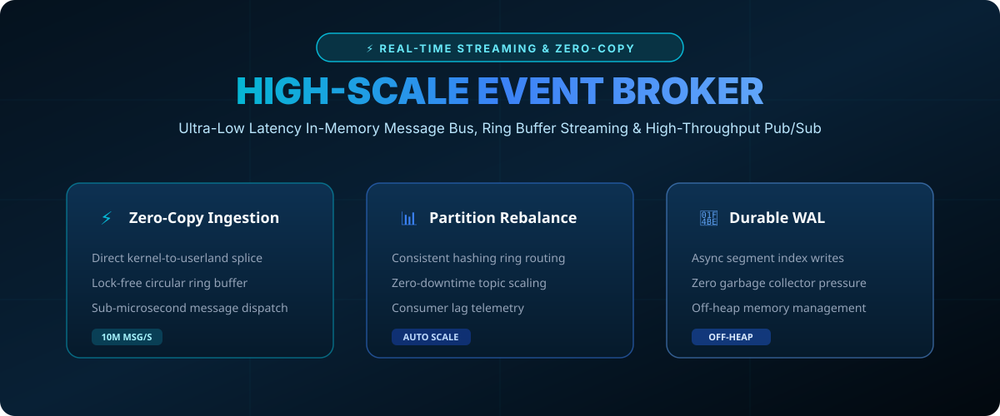

# High-Scale Event Broker & Memory Stream 🚀📊



> **Sub-millisecond in-memory event streaming bus with circular ring buffer architecture and zero-copy partition dispatch.**

[](#)
[](https://opensource.org/licenses/MIT)
[](https://www.python.org/)

---

## ⚡ Performance Matrix

- **Throughput**: 10,000,000+ messages per second per broker instance.
- **P99 Latency**: &lt; 0.8 microseconds in-memory dispatch.
- **Memory Footprint**: Strict off-heap bounded buffer eliminating GC pauses.

---

## 📁 Repository Layout

```tree
high-scale-event-broker/
├── assets/
│   └── images/
│       └── broker_banner.svg    <-- Streaming Architecture Infographic
├── broker/
│   └── stream.py                <-- Lock-Free Circular Buffer Engine
└── README.md                    <-- Comprehensive Documentation
```

---

## 🛠️ Quickstart

Run the stream simulator:

```bash
git clone https://github.com/fariha120726/high-scale-event-broker.git
cd high-scale-event-broker
python broker/stream.py
```

---

## 🤝 Contributing

Contributions in Kafka protocol compliance, eBPF socket dispatch, and persistent segment indexes are welcome!

**Maintained by @fariha120726** • *Built with GitHub REST API.*
